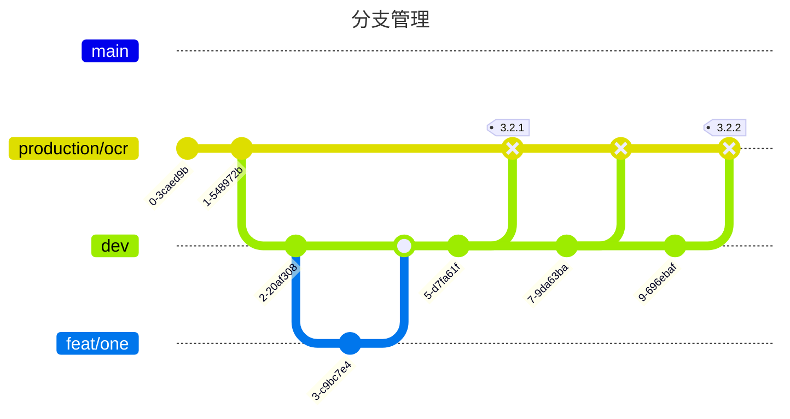

## 工作内容


```python

def funchtion(params):
  return 0

```

```bash
$ docker ps -a
```


```mermaid
---
title: 分支管理
---
gitGraph
   branch production/ocr
   commit
   commit
   branch dev
   commit
   branch feat/one
   commit
   checkout dev
   merge feat/one
   checkout dev
   commit
   checkout production/ocr
   merge dev tag: "3.2.1" type: REVERSE
   checkout dev
   commit
   checkout production/ocr
   merge dev type: REVERSE
   checkout dev
   commit
   checkout production/ocr
   merge dev tag: "3.2.2" type: REVERSE
```
